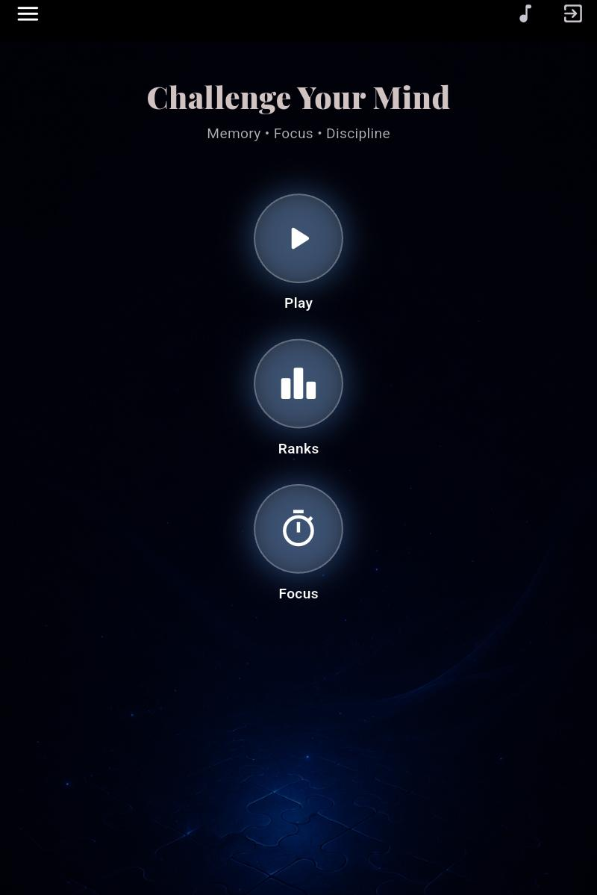
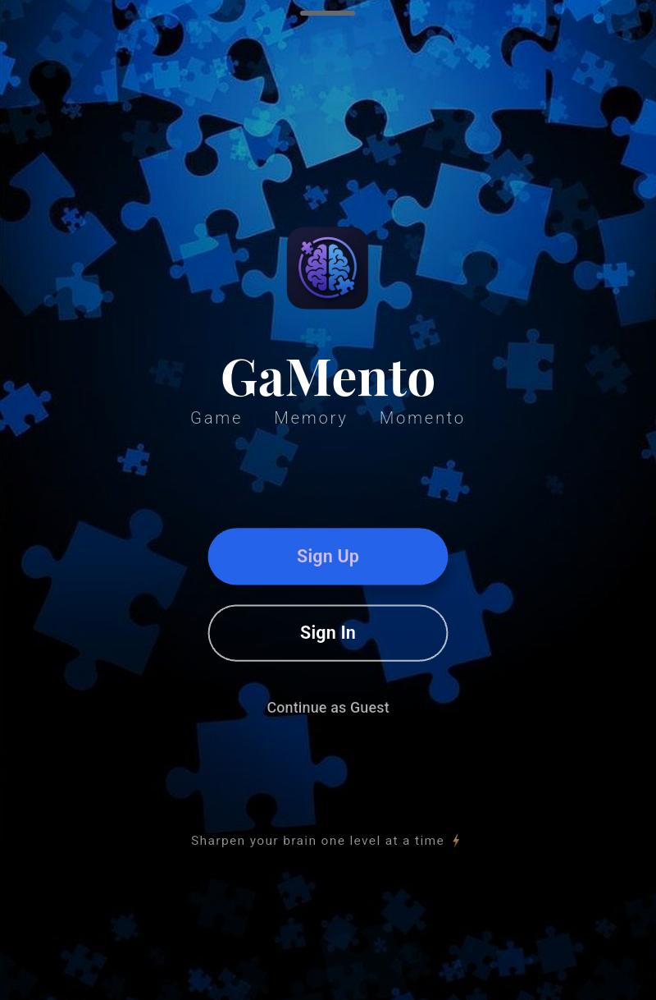
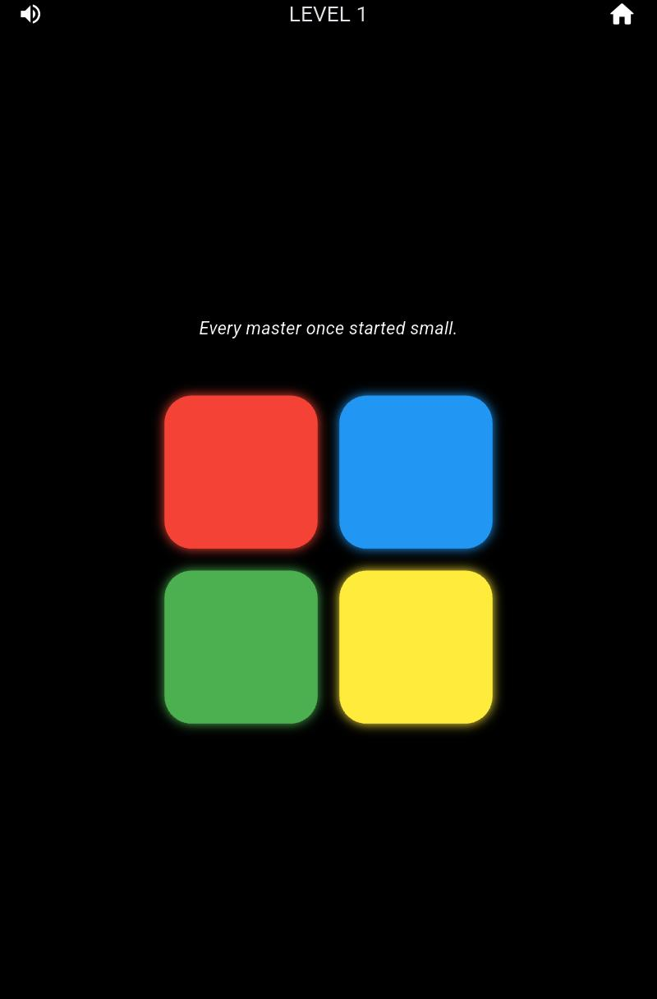
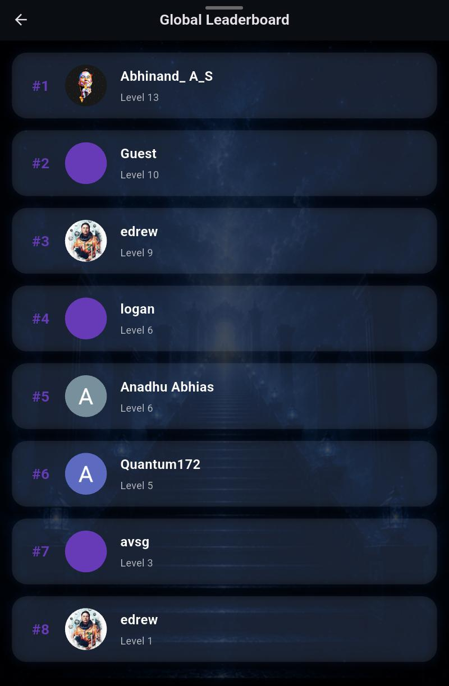

# GaMento

GaMento is a Flutter-based memory training game designed to improve focus, memory retention, and mental discipline.

## Features

* Memory challenge gameplay
* Global leaderboard using Firebase
* Google Sign-In
* Focus timer mode
* Beautiful blue-themed UI
* Background music
* Cross-device score tracking

## Built With

* Flutter
* Firebase Authentication
* Cloud Firestore
* Shared Preferences
* Audioplayers

## Screenshots

  
  
  
  

## Download

APK available on Itch.io:
https://abhi-369.itch.io/gamento
